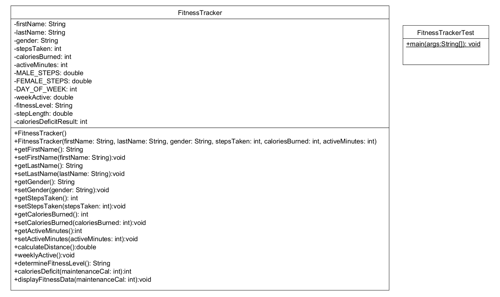

# 🏋️‍♂️ Fitness Tracker Application - Java OOP Project


A complete Java implementation of a fitness tracking system demonstrating object-oriented programming principles with JUnit testing.

## ✨ Features

- **User Profile Management** (Name, gender, activity metrics)
- **Comprehensive Fitness Metrics**:
  - Step/distance conversion (gender-specific stride length)
  - Calories deficit/surplus calculation
  - Weekly activity analysis
- **Fitness Level Classification** (Active/Moderately Active/Sedentary)
- **Interactive Console Interface**
- **JUnit Test Coverage**

## 📊 UML Diagram
<p align="center">
  
</p>

## 🚀 How to Run
1. Clone the repository
2. Compile and run FitnessTrackerTest.java
3. Follow console prompts to input your fitness data

## Example Usage 📝
```
--- User Fitness Data ---
Name: John Doe
Gender: Male
Daily Steps: 8500
Distance Walked: 6800.0 meters
Weekly Active Minutes: 455.0
Fitness Level: Active
Daily Calories Deficit/Surplus: 1550
```
